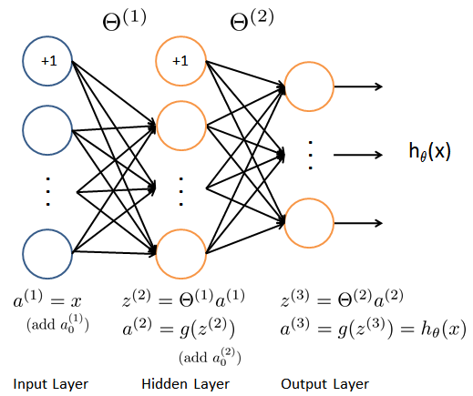
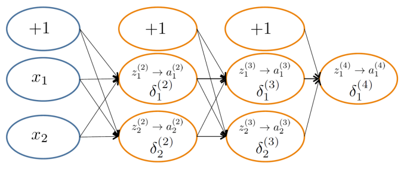
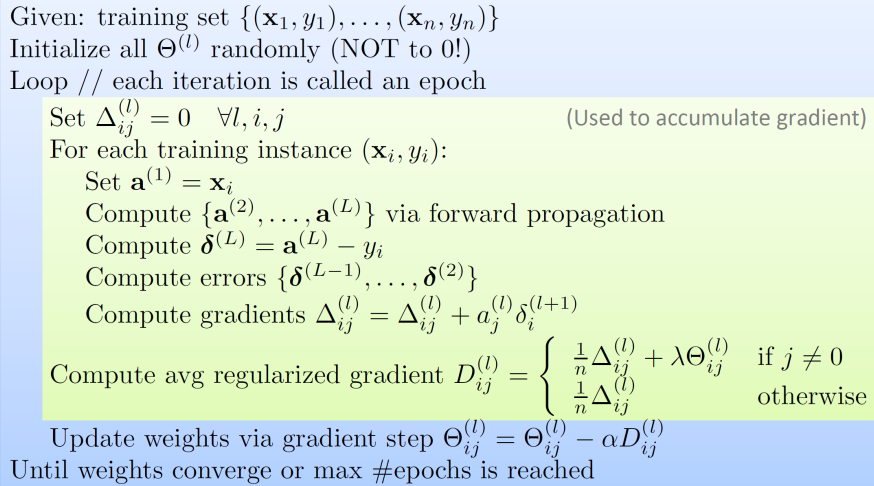
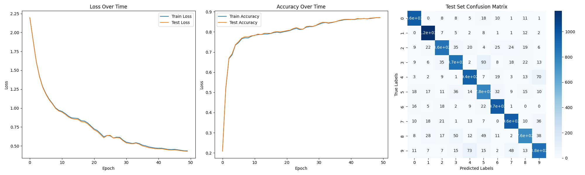

# Multi-Layered Perceptron

## Table of Contents

- [Overview](#overview)
- [Installation](#installation)
- [Usage](#usage)
- [Code Explanation](#code-explanation)
  - [Class Initialization](#class-initialization)
  - [Forward Pass](#forward-pass)
  - [Backpropagation](#backpropagation)
  - [Training](#training)
  - [Prediction](#prediction)
- [Results](#results)
- [Future Improvements](#future-improvements)
- [Contributing](#contributing)

## Overview

This project implements a multi-layered perceptron (MLP) from scratch using only NumPy. One unique aspect of this implementation is that you can specify any number of hidden dimensions with arbitrary lengths, allowing you to build feed-forward neural network architectures with varying complexities. It is trained and evaluated on the MNIST dataset.

## Installation

1. Clone the repository:

   ```sh
   git clone https://github.com/nicholasbaard/Multi-Layered-Perceptron.git
   cd Multi-Layered-Perceptron
   ```

2. Install the required dependencies:

   ```sh
   pip install -r requirements.txt
   ```

## Usage

Run the training script with default parameters:

```sh
cd src
python main.py
```

This will download the MNIST dataset, train the MLP and create a plot with the training and testing results.

### Options

To customize the training parameters, use the following options:

- `--hidden_dim`: List of hidden layer dimensions. Default: `[128, 64]`. This creates three hidden layers with the dimensions 128 and 64.
- `--activation`: Activation function to use (`sigmoid`, `tanh`, `relu`). Default: `sigmoid`.
- `--epochs`: Number of training epochs. Default: `50`.
- `--alpha`: Learning rate. Default: `0.1`.
- `--epsilon`: Early stopping criterion. Default: `1e-4`.
- `--batch_size`: Size of each training batch. Default: `64`.
- `--lambda_reg`: Regularization parameter. Default: `1e-3`.
- `--show_plots`: Display training plots. Default: `False`.

## Code Explanation

### Class Initialization

The `MLP` class initializes the network with given input dimensions, hidden layers, output dimensions, and activation function.

#### Forward Pass

The `forward` method performs the forward propagation through the network, calculating the activations for each layer using the specified activation function.



#### Backpropagation

The `backpropagate` method calculates the gradients of the loss function with respect to the weights and biases using backpropagation and updates them accordingly.



#### Training

The `train` method handles the training loop, including forward pass, backpropagation, and metrics computation. It supports early stopping based on the change in loss.



#### Prediction

The `predict` method performs inference on new data, returning the predicted class labels.

## Results

Here are the results from training using the default parameters:


## Future Improvements

- [ ] Implement different optimization methods like Adam and RMSProp
- [ ] Create an experiments script that allows for multiple hyperparameters to be tested and results to be compared
- [ ] Generalise MLP class to work for multiple problems (Regression, Binary Classification)
- [ ] Saving model weights and hyperparameters

## Contributing

Contributions are welcome! Please open an issue or submit a pull request for any improvements or bug fixes.
